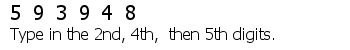
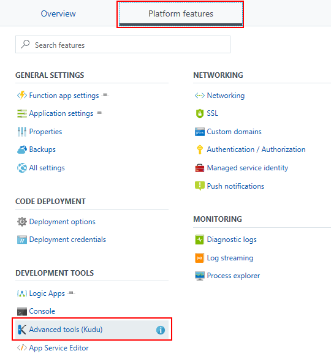
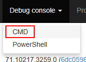
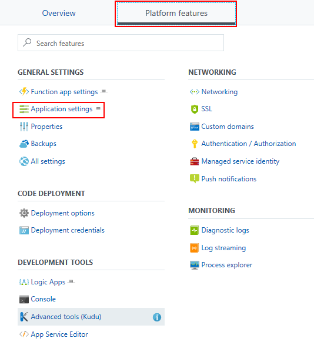
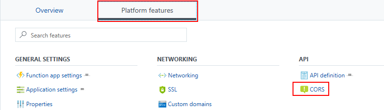
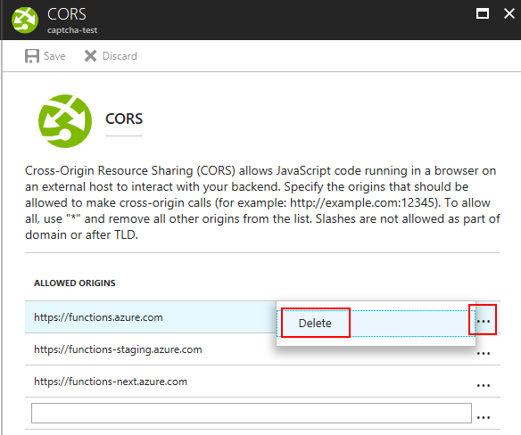
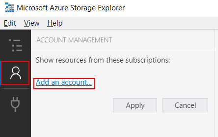
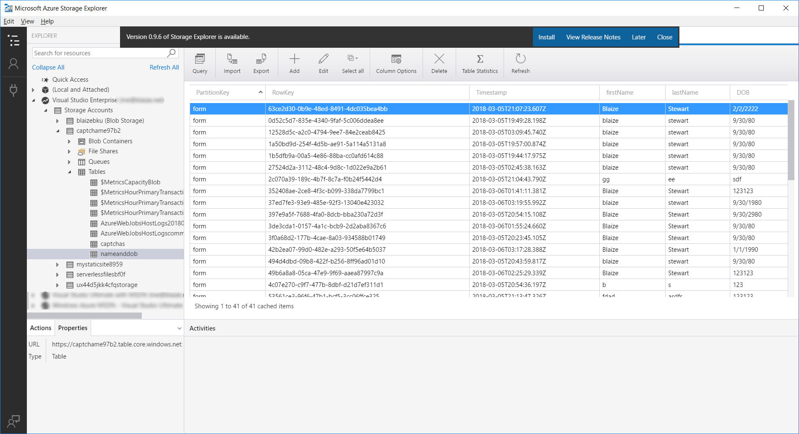

CAPTCHA with Azure Functions
====

[CAPTCHA's](https://en.wikipedia.org/wiki/CAPTCHA) are those things that site administrators love because they stop comment and form spam but user hate because they are impossible to read. Regardless though, they have become a mainstay in Internet usage, particularly on websites that allow for unauthenticated feedback. CAPTCHA's are intended to prevent automated responses from computers by generating a test that is easy for a human to solve by more difficult for a computer to solve. 

This function creates a graphic with randomly generated digits and asks the user to type in those digits in a specific order. 



Each CAPTCHA is only valid for one attempt. After a failed attempt, a new CAPTCHA is generated.

Azure Functions provide a convenient way of creating scalable, serverless "functions". Functions enable applications developers to write event-driven code (ie. “functions”) than can be triggered by timers, manual integration, HTTP requests, service buses, message queues and many other integration points. These functions can be written in a number of different languages including C#, NodeJS (which this function uses), Python, PHP and a myriad of of other languages. CAPTCHAs are a good candidate for a function because they are called via HTTP requests and can be responded to via requests.

If you have not already done so create an Azure Function. There are a few ways to do this -- either in the [portal](https://docs.microsoft.com/en-us/azure/azure-functions/functions-create-first-azure-function), through the [Azure CLI](https://docs.microsoft.com/en-us/azure/azure-functions/functions-create-first-azure-function-azure-cli), or with [Visual Studio](https://docs.microsoft.com/en-us/azure/azure-functions/functions-create-your-first-function-visual-studio). The Azure Portal is probably the easiest way to do it.

This function is using NodeJS to create and validate a CAPTCHA's. NodeJS does not explicitly support any graphics libraries, so this implementation uses the NPM package [GM](https://github.com/aheckmann/gm), which is a wrapper around the [GraphicsMagick CLI](http://www.graphicsmagick.org/) utility. Results from validate CAPTCHAs are stored in [Azure Table Storage](https://azure.microsoft.com/en-us/services/storage/tables/) and can be sent via email using [SendGrid](https://sendgrid.com/). 

There are two ways to use this function -- one with HTTP redirects and another with AJAX. Using AJAX, however, requires that the function use a custom CORS implementation. If you want to integrate this with an existing app to use the function, that is possible, however if you want to call it from another app hosted with a different domain (ie. "Origin"), then its best to install this function as a stand-alone Function App.

## Setup the CAPTCHA Function

1. In the Function App, you can use the portal to clone the function from its GitHub repo. In the Azure Portal, click on **Platform Features**, then select **Advanced Tools (Kudu)**. Kudu will launch in a new tab. 

	

1. In Kudu, select **Debug Console**, then select **CMD**. This will launch a Terminal window.

	

1. In the browser, you will see a file explorer. Click on **site** then **wwwroot**. (Cloning into an empty folder isn't possible because Azure Functions creates the host.json file automatically and it cannot be removed. It must be edited or overwritten.)

1. In wwwroot, clone the GitHub repo

	````
	git clone https://github.com/theonemule/azure-function-captcha.git
	````

1. Now, move the files from the repo folder into the wwwroot folder. Overwrite any files it may ask you to overwrite.

	````
	robocopy /E /MOV  azure-function-captcha/ .
	````

	If you are integrating this with an existing app, simply move the function's folder.

	````
	robocopy /E /MOV  azure-function-captcha/GetChaptcha .
	````


1. Remove the folder created by git.

	````
	rd /s azure-function-captcha
	````

1. Change directories to the function.

	````
	cd GetChaptcha
	````

1. Install the NodeJS dependencies.

	````
	npm install
	````

## Configure Email Function (Optional)

If you want the function to send you an email whenever a form is successfully submitted, then complete the following steps.

1. You'll need a SendGrid Account. You can get a free SendGrid account from Azure that can send up to 25,000 messages a month. Learn how to [set it up here](https://docs.microsoft.com/en-us/azure/sendgrid-dotnet-how-to-send-email). Once the account is setup, get an API Key from SendGrid.

1. Navigate back to the **Platform Features**, then select **Application Settings**.

	

1. In Application Settings, scroll down to the **Application settings** subsection, then click on **+ Add new setting**

1. For the name, enter **notifyEmail** and enter in the email address you want to use for notifications.

1. Click on **+ Add new setting** again. Enter in **sendgridAPIKey** for the name and the API Key you got from SendGrid for the value.

1. Click Save at the top of the Applications Settings screen.

## Configure a Form with Redirects

If the redirect fields are configured, the CAPTCHA function will redirect the browser to either a success URL for correctly solved CAPTCHA's or a fail URL whenever a user submits a form. 

The form below has two hidden fields: **captchaSuccessURL**  and **captchaFailURL** which correspond to the success and fail URL's respectively. 

**captchaSet** is the name of the table where the results of the form will be recorded in Azure Table Storage. This fields is optional. If it is not populated, then data is written to a table called "Forms".

**captcha** is a text field where the the user will enter in the solved captcha.

All other fields are data fields and will be recorded as data.
	
	<!DOCTYPE html>
	<html>
	<head>
	<meta charset="UTF-8">
	<title>CAPTCHA</title>
	</head>

	<body>
	<form method="POST" action="https://yourfunctionapp.azurewebsites.net/api/GetCaptcha">
	<p>First Name: <input type="text" name="firstName"></p>
	<p>Last Name: <input type="text" name="lastName"></p>
	<p>Birthday: <input type="text" name="DOB"></p>
	<input type="hidden" value="nameanddob" name="captchaSet">
	<input type="hidden" value="https://example.com/success.html" name="captchaSuccessURL">
	<input type="hidden" value="https://example.com/fail.html" name="captchaFailURL">
	
	<p>CAPTCHA: <input type="text" name="captcha"></p>
	<input type="submit" value="Submit">
	</form>
	</body>

	</html>
	

## Configure a Form with AJAX

AJAX is a more convenient way to submit a form because it does not cause the browser to navigate away from the page entering the data causing the user to lose his or her data in some instances. If the CAPTCHA fails, a new one is generated and the user simply attempts to resubmit with the new CAPTCHA. 

The AJAX implementation requires that the CORS middleware for Azure Funcitons be turned off. It only allows for one of the many types of CORS HTTP headers. The CAPTCHA Function then will handle CORS. To disable the **CORS** settings on the **Platform Features** control panel.



Then, delete each of the CORS entries in the list.




As above, there are two fields of note:

**captchaSet** is the name of the table where the results of the form will be recorded in Azure Table Storage. This fields is optional. If it is not populated, then data is written to a table called "Forms".

**captcha** is a text field where the the user will enter in the solved captcha.

All other fields are data fields and will be recorded as data.

	<!DOCTYPE html>
	<html>
	<head>
	<meta charset="UTF-8">
	<title>CAPTCHA with AJAX</title>
	</head>


	<body>

	<script>

	function SubmitForm(){
	
		//Encodes the data from the form as URL encoded data.
		var formData = "firstName=" + encodeURIComponent(document.getElementById("firstName").value)
		formData += "&lastName=" + encodeURIComponent(document.getElementById("lastName").value)
		formData += "&DOB=" + encodeURIComponent(document.getElementById("DOB").value)
		formData += "&captchaSet=" + encodeURIComponent(document.getElementById("captchaSet").value)
		formData += "&captcha=" + encodeURIComponent(document.getElementById("captcha").value)

		//Use the XHR object to send a request.
		var request = new XMLHttpRequest();
		request.open("POST", "https://captchame.azurewebsites.net/api/GetCaptcha");
		request.setRequestHeader('Content-Type','application/x-www-form-urlencoded')
		request.withCredentials = true; 
		request.send(formData);
		
		request.onreadystatechange = function() {
			if (request.readyState == 4 && request.status === 200) {
				var success = (request.responseText == "True" ) //Response text will be "True" if the CAPTCHA was successful.
				if (success){
					alert("Captcha was successful!")
				}else{
					alert("Captcha was not successful. Please try again.")
					document.getElementById("captchaImg").src="https://captchame.azurewebsites.net/api/GetCaptcha"
				}
		   }
		};    
		
	}

	</script>
		
		
	<p>First Name: <input type="text" id="firstName"></p>
	<p>Last Name: <input type="text" id="lastName"></p>
	<p>Birthday: <input type="text" id="DOB"></p>
	<input type="hidden" value="nameanddob" id="captchaSet">
	
	<p>CAPTCHA: <input type="text" id="captcha"></p>
	<input type="button" value="Submit" onclick="SubmitForm()">

	</body>

	</html>


## Viewing Results

All results for the forms are stored in Table Storage. You can view Table Storage using Azure Storage Explorer. This utility lets you see all the blobs, files, tables, and queues in your storage accounts. Click on the **User** icon, then click **Add an account**. Depending on how you connect to the storage account depends on how you will complete the wizard. Most likely, you can choose Add an Azure account and complete the wizard that way.



Once Storage Explorer is connected, you can drill down into the storage account for your Function App and find the with the named supplied in the **captchaSet** input and view the results. If captchaSet was not supplied, the name will be **forms**.




